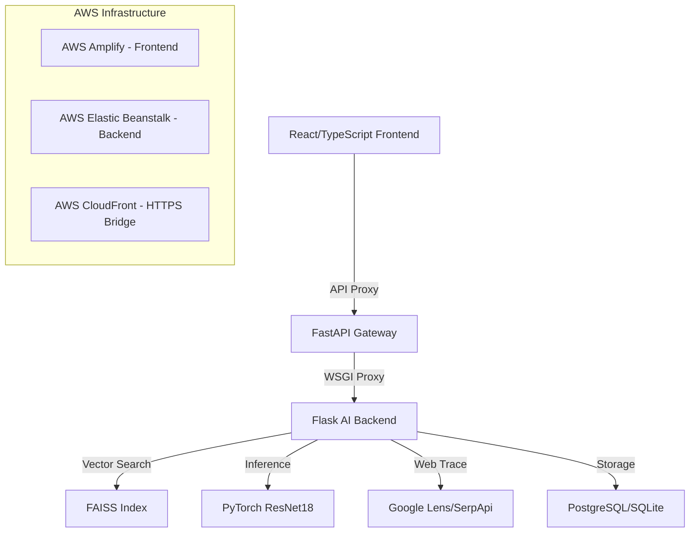

# 🛡️ DeepShield AI — Identity Protection Platform

[](https://www.typescriptlang.org/)
[](https://reactjs.org/)
[](https://flask.palletsprojects.com/)
[](https://aws.amazon.com/)

**DeepShield AI** is a professional-grade security platform designed to detect, track, and mitigate the risks of AI-generated media. By combining cutting-edge computer vision, vector similarity search, and global web tracing, DeepShield provides users with the tools to protect their digital identity in an era of hyper-realistic deepfakes.

---

## 🛠️ System Architecture

DeepShield AI utilizes a three-tier architecture designed for high availability and low-latency AI inference.



---

## 🌟 Advanced Features

### 🔍 Face Trace (Global Identity Search)
The flagship feature of DeepShield. Upload a facial image to initiate a global search.
- **Visual Mapping**: Uses high-dimensional facial embeddings to identify matches across indexed web sources.
- **Direct Action**: Provides clickable source links to every website where your image is circulating.
- **Privacy First**: Images are processed in a secure buffer and never permanently stored unless added to history.

### 🤖 Multi-Engine Deepfake Detection
- **ResNet18 Neural Network**: Fine-tuned on the FaceForensics++ dataset for high-accuracy manipulation detection.
- **Real-Time Processing**: Frame-by-frame analysis for video uploads (MP4, WEBM).
- **Verdicts**: Provides a detailed probability score (Real vs. Deepfake) based on sub-surface facial artifact analysis.

### ⚡ FAISS Vector Similarity Engine
- **FaceNet Integration**: Extracts 512-dimensional facial embeddings.
- **Similarity Matching**: Leverages a Facebook AI Similarity Search (FAISS) index to find visually similar threats in your scan history.

### 🚨 Real-Time Security Dashboard
- **Live Threats**: Backend-driven alert system that monitors unauthorized scanning attempts.
- **Webcam Integration**: Direct capture and scan from local media devices.
- **Evidence Reports**: Generate legally-compatible PDF reports featuring cryptographic scan hashes and detection metrics.

---

## 💻 Technical Stack

| Component | Technology |
| :--- | :--- |
| **Frontend** | React 19, TypeScript, Framer Motion, Tailwind CSS, Lucide Icons |
| **Gateway** | FastAPI, Uvicorn |
| **Backend** | Flask, SQLAlchemy, OpenCV, NumPy |
| **AI/ML** | PyTorch (ResNet18), FaceNet (MTCNN), FAISS |
| **Infrastructure** | AWS Amplify, AWS Elastic Beanstalk, AWS CloudFront |
| **Database** | PostgreSQL (Production), SQLite (Testing/Local) |

---

## 🔧 Installation & Development

### 1. Repository Initialization
```bash
git clone https://github.com/BenhurBakki/DeepShield-Ai.git
cd DeepShield-Ai
```

### 2. Frontend Setup (React + TS)
```bash
# Install dependencies
npm install

# Run dev server
npm run dev
```

### 3. Backend Setup (Flask + AI Stack)
```bash
cd backend
python -m venv venv
source venv/bin/activate # Windows: venv\Scripts\activate

# Install AI dependencies (CPU optimized for production)
pip install -r requirements.txt

# Start the High-Performance Gateway
python fastapi_gateway.py
```

---

## ☁️ Cloud Deployment

### AWS Amplify (Frontend)
- Automated CI/CD triggered via the `main` branch.
- Proxy rules configured in `amplify.yml` to route `/api/*` requests to the CloudFront bridge.

### AWS Elastic Beanstalk (Backend)
- Deployed via the `DeepShield_EB_Final.zip` bundle.
- Configured with `Python 3.11` on Amazon Linux 2023.
- Environment variables: `SERPAPI_KEY`, `SECRET_KEY`, `DATABASE_URL`.

### HTTPS/CORS Bridge
- **AWS CloudFront** distribution `dejvzlgtkqd2u.cloudfront.net` handles SSL termination and proxies requests to the EB environment to prevent "Mixed Content" security blocks.

---

## 📄 API Documentation

### `POST /api/detect`
Analyzes an image for deepfake probability and performs a vector search.
- **Payload**: `multipart/form-data` with `file`.
- **Response**: Probability scores, verdict, and similar matches.

### `POST /api/face-trace/search`
Initiates an asynchronous global web search for a face.
- **Payload**: `multipart/form-data` with `file`.
- **Response**: `task_id` for polling.

### `GET /api/alerts`
Retrieves live security alerts from the backend engine.

---

## 🛡️ License & Safety
DeepShield AI is provided for identity protection and investigative research. The creators do not condone the use of this tool for unauthorized surveillance or harassment.

© 2025 DeepShield AI. Built with precision for digital safety.
